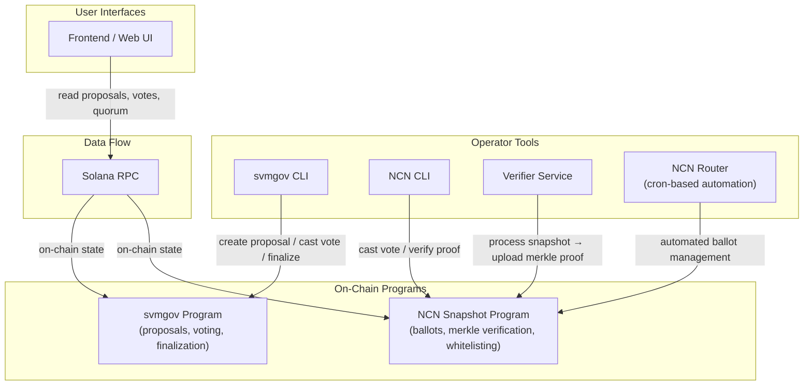

# Architecture & Glossary

This document provides a visual overview of how the Solana Governance System components connect, and defines key terminology.

## System Architecture

## Component Overview

### SVM Governance Track (`svmgov/`)

The primary governance track for all Solana validators and stakers.

| Component | Location | Purpose |
|-----------|----------|---------|
| **Program** | `svmgov/program/` | On-chain Anchor program — proposals, stake-weighted voting, vote overrides, finalization |
| **CLI** | `svmgov/cli/` | Command-line interface for creating proposals, casting votes, and managing governance |
| **Frontend** | `frontend/` | Web UI for browsing proposals, voting, and monitoring quorum progress |

**Flow:** Validator/staker uses CLI or frontend → transaction hits svmgov program → on-chain state updates → frontend reads and displays results.

### NCN Governance Track (`ncn/`)

Governance for the Node Consensus Network — a subset of whitelisted operators.

| Component | Location | Purpose |
|-----------|----------|---------|
| **Program** | `ncn/programs/ncn-snapshot/` | On-chain program — ballot boxes, merkle proof verification, operator whitelisting |
| **CLI** | `ncn/cli/` | Command-line interface for casting NCN votes and verifying proofs |
| **Verifier Service** | `ncn/verifier-service/` | Off-chain service that processes epoch snapshots and uploads merkle proofs on-chain |
| **Router** | `ncn-router/` | Cron-based automation for ballot management and routing |

**Flow:** Verifier service downloads epoch snapshot → generates merkle tree → uploads proof on-chain → operators vote via CLI → ballot finalized when quorum reached.

## Data Flow

1. **Epoch snapshot** — The verifier service fetches a snapshot of validator stake at a specific epoch
2. **Merkle tree generation** — Snapshot data is hashed into a merkle tree, producing a root hash and per-validator proofs
3. **On-chain upload** — The merkle root is uploaded to the NCN program as a verifiable commitment
4. **Proof verification** — When a validator votes, their merkle proof is verified against the on-chain root to confirm their inclusion and stake weight
5. **Vote aggregation** — Votes accumulate in a ballot box, weighted by stake
6. **Finalization** — When quorum is reached, the proposal outcome is finalized on-chain

## Glossary

| Term | Definition |
|------|-----------|
| **Ballot** | A voting container for an NCN proposal, tracking cast votes by operator |
| **Ballot Box** | On-chain account that aggregates all votes for a specific NCN ballot |
| **Epoch** | A ~2-3 day period on Solana; governance snapshots are taken per-epoch |
| **Finalization** | The process of locking a proposal outcome once quorum conditions are met |
| **Merkle Proof** | Cryptographic proof verifying a validator's inclusion and stake weight in an epoch snapshot |
| **Merkle Root** | The top-level hash of a merkle tree, stored on-chain as a verifiable commitment to snapshot data |
| **NCN** | Node Consensus Network — a subset of whitelisted validators participating in merkle-proof governance |
| **Operator Whitelist** | On-chain list of authorized NCN operators who can participate in ballot voting |
| **Proposal** | A governance action submitted for validator/staker voting, with defined phases and quorum requirements |
| **Quorum** | Minimum stake weight required for a proposal to pass or be finalized |
| **Stake Weight** | A validator's voting power, determined by their active stake delegation |
| **Support Phase** | Initial phase where validators signal support for a proposal before formal voting begins |
| **SVM Governance** | The primary governance track using Solana's stake-weighted voting for all validators and stakers |
| **Verifier Service** | Off-chain service that processes epoch snapshots and uploads merkle proofs to the NCN program |
| **Vote Override** | Mechanism allowing stakers to override their delegated validator's vote on a proposal |
