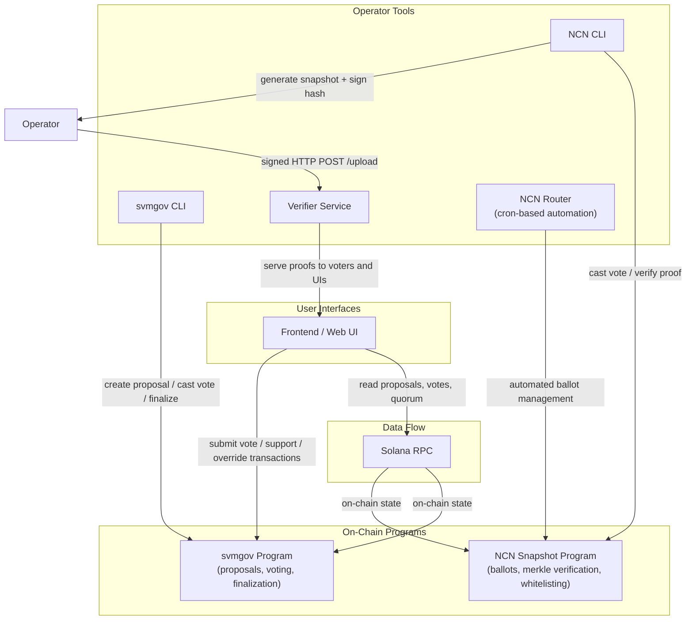

# Architecture & Glossary

This document provides a visual overview of how the Solana Governance System components connect, and defines key terminology.

## System Architecture

```mermaid
graph TB
    subgraph "On-Chain Programs"
        SVMGOV["svmgov Program
(proposals, voting, finalization)"]
        NCN["NCN Snapshot Program
(ballots, merkle verification, whitelisting)"]
    end

    subgraph "Operator Tools"
        SVMCLI["svmgov CLI"]
        NCNCLI["NCN CLI"]
        VS["Verifier Service"]
        ROUTER["NCN Router
(cron-based automation)"]
    end

    subgraph "User Interfaces"
        FE["Frontend / Web UI"]
    end

    subgraph "Data Flow"
        RPC["Solana RPC"]
    end

    SVMCLI -->|"create proposal / cast vote / finalize"| SVMGOV
    NCNCLI -->|"cast vote / verify proof"| NCN
    NCNCLI -->|"generate snapshot + sign hash"| OP["Operator"]
    OP -->|"signed HTTP POST /upload"| VS
    VS -->|"serve proofs to voters and UIs"| FE
    ROUTER -->|"automated ballot management"| NCN
    FE -->|"read proposals, votes, quorum"| RPC
    FE -->|"submit vote / support / override transactions"| SVMGOV
    RPC -->|"on-chain state"| SVMGOV
    RPC -->|"on-chain state"| NCN
```

## Component Overview

### SVM Governance Track (`svmgov/`)

The primary governance track for all Solana validators and stakers.

| Component | Location | Purpose |
|-----------|----------|---------|
| **Program** | `svmgov/program/` | On-chain Anchor program — proposals, stake-weighted voting, vote overrides, finalization |
| **CLI** | `svmgov/cli/` | Command-line interface for creating proposals, casting votes, and managing governance |
| **Frontend** | `frontend/` | Web UI for browsing proposals, voting, and monitoring quorum progress |

**Flow:** Validator/staker uses CLI or frontend → transaction hits svmgov program → on-chain state updates → frontend reads and displays results.

### NCN Governance Track (`ncn/`)

Governance for the Node Consensus Network — a subset of whitelisted operators.

| Component | Location | Purpose |
|-----------|----------|---------|
| **Program** | `ncn/programs/ncn-snapshot/` | On-chain program — ballot boxes, merkle proof verification, operator whitelisting |
| **CLI** | `ncn/cli/` | Command-line interface for casting NCN votes and verifying proofs |
| **Verifier Service** | `ncn/verifier-service/` | Off-chain service that indexes operator-uploaded snapshots and serves merkle proofs over HTTP. It does not write on-chain |
| **Router** | `ncn-router/` | Cron-based automation for ballot management and routing |

**Flow:** Each whitelisted operator independently generates a snapshot at the target slot → casts a vote for its merkle root via CLI → when enough operators agree, `finalize_ballot` writes the `ConsensusResult` on-chain → operators upload their snapshot to a verifier service, which serves proofs against the finalized root.

## Data Flow

1. **Independent snapshot generation** — Each whitelisted operator replays the ledger to the target slot and builds its own MetaMerkleSnapshot
2. **Merkle tree** — Two-tier: a top-level tree over vote accounts, each leaf carrying a sub-root over that validator's stake accounts
3. **Operator voting** — Each operator casts its merkle root and snapshot hash into the `BallotBox` via `cast_vote`. All whitelisted operators carry equal weight
4. **Consensus** — Once `min_consensus_threshold_bps` of operators agree on the same ballot, `finalize_ballot` creates the on-chain `ConsensusResult`
5. **Proof service** — Operators upload their snapshots to verifier services, which serve per-account proofs against the finalized root
6. **Verification** — `verify_merkle_proof` checks a vote-account or stake-account leaf against the `ConsensusResult` root, typically via CPI from the governance program

## Glossary

| Term | Definition |
|------|-----------|
| **Ballot** | A voting container for an NCN proposal, tracking cast votes by operator |
| **Ballot Box** | On-chain account that aggregates all votes for a specific NCN ballot |
| **Epoch** | A ~2-3 day period on Solana; governance snapshots are taken per-epoch |
| **Finalization** | The process of locking a proposal outcome once quorum conditions are met |
| **Merkle Proof** | Cryptographic proof verifying a validator's inclusion and stake weight in an epoch snapshot |
| **Merkle Root** | The top-level hash of a merkle tree, stored on-chain as a verifiable commitment to snapshot data |
| **NCN** | Node Consensus Network — a subset of whitelisted validators participating in merkle-proof governance |
| **Operator Whitelist** | On-chain list of authorized NCN operators who can participate in ballot voting |
| **Proposal** | A governance action submitted for validator/staker voting, with defined phases and quorum requirements |
| **Quorum** | In `svmgov`, the stake-weighted threshold a proposal must reach. In NCN, `min_consensus_threshold_bps` — the share of whitelisted operators that must agree on a ballot |
| **Stake Weight** | A validator's voting power, determined by their active stake delegation |
| **Support Phase** | Initial phase where validators signal support for a proposal before formal voting begins |
| **SVM Governance** | The primary governance track using Solana's stake-weighted voting for all validators and stakers |
| **Verifier Service** | Off-chain service that indexes operator-uploaded snapshots and serves merkle proofs over HTTP; it does not publish on-chain |
| **Vote Override** | Mechanism allowing stakers to override their delegated validator's vote on a proposal |
